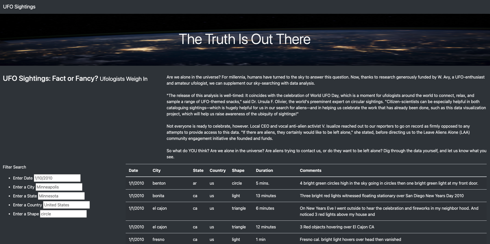
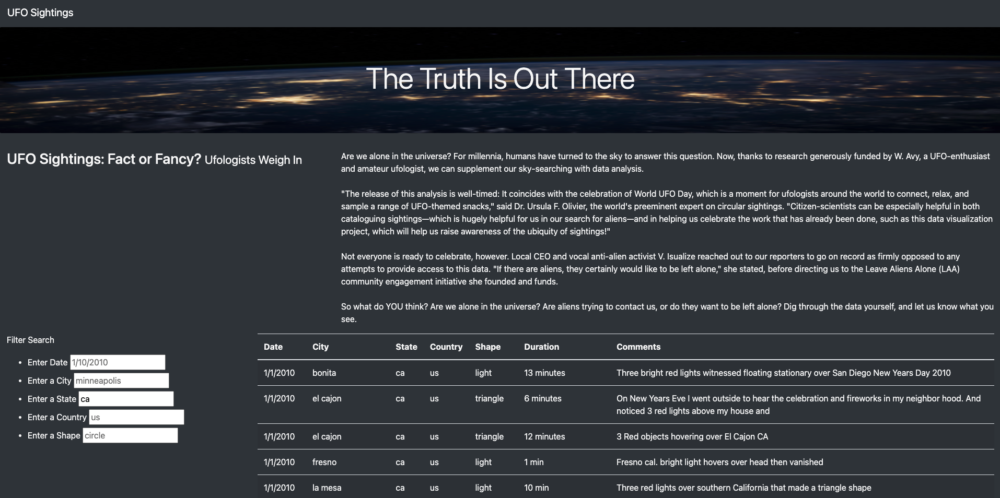
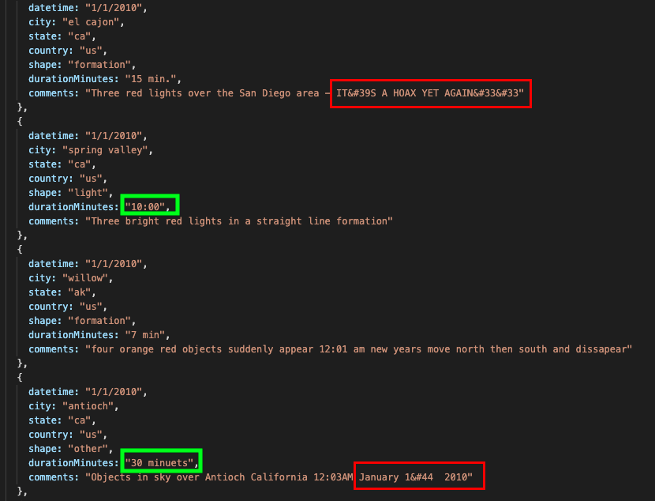
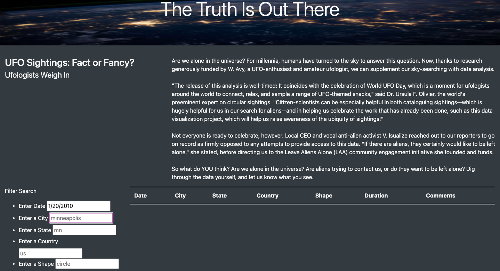

# **Overview of Project**

The purpose of this project is to customize a webpage with Bootstrap features to display UFO sightings data by building a table from a JavaScript array. The focus of this project is to create filters to make the table fully dynamic. The table on the webpage was initially setup with only one filter (date) which was activated when the user pressed "Enter". The webpage was customized and additional filters were added for city, state, country, and shape. In addition, rather than keeping the existing code to filter results on click, the code was updated to filter through the results when the inputs changed.

# **Results**
With the modified code and adjustments to the HTML index document, when a user visits the webpage and inputs criteria into the different filters (date, city, state, country, and/or shape), the table results on the bottom right of the webpage will change as the filter criteria is being inputted by the user. The table results will automaticlaly adjust based on filter input by the user without the user having to do anything else. We can observe the webpage with no filter criteria set compared to the webpage with filter criteria inputted and the resulting table data that appears on the page for when filter criteria is present and when it isn't. See screenshots of webpage below without filter criteria inputted and with filter criteria.

##### *Screenshot of webpage with no filter criteria set*

##### *Screenshot of webpage with filter criteria for state*

# **Summary**
## *Drawbacks & Limitations* 
This project provides an easy way for a user interested in UFO data to do a query and search for data based on filter criteria the user is interested in. There are some drawbacks to the webpage and code the way it is currently. The data source used in this project records the same pieces of data in inconsistent ways (see green boxes outlining this in the screenshot of the data source below). Additionally, the data source also contains random characters and numbers (see red boxes outlining this in the screenshot of the data source below). This is not necessary a limitation of the webpage but of the current data file used. 

##### *Screenshot of data file*

One drawback of the existing webpage is that there is no feedback to the user if the filter criteria set by the user does not match any results. The results table does not return any data but there is no clear and obvious indication to the user. This could result in confusion as to if the search criteria did not match any results or if there was an error that occured on the page.

##### *Screenshot of results table when filter criteria does not match any results*

## *Recommendations for Further Development* 
The webpage and existing code and HTML elements are fairly simplistic in nature. Based on some of the drawbacks mentioned above, I would recommend a review of the data to determine if any clean up should be conducted first. There are inconsistencies in how the same data is recorded. The data file should be reviewed by the project manager not just to ensure the data is clean but also to better understand the dataset and the best ways to achieve and represent the goals of the project. For example, the shapes recorded fall into a handful of options and it may be a better option to create a drop down menu option for this filter rather than rely on user input.

Another recommendation for further development is to incorporate visual ways to represent the data and search results to make the datd and results more appealing to view for the user. A dynamic geographic map can be developed that would respond to the filter search of the user to display the results visually on a map in addition to a table. The geographic map could incorporate circles similar to a bubble chart that appear larger in size over parts of the map where more sightings happen. The map can be developed to have zoom functionality. As the user zooms into the map, more detailed visuals are available for viewing such as a key box with label markers that summarize the data in the table columns (date, city, state, country, duration, size, and comments) when the user hovers over the circle marker for the location of the sighting.
